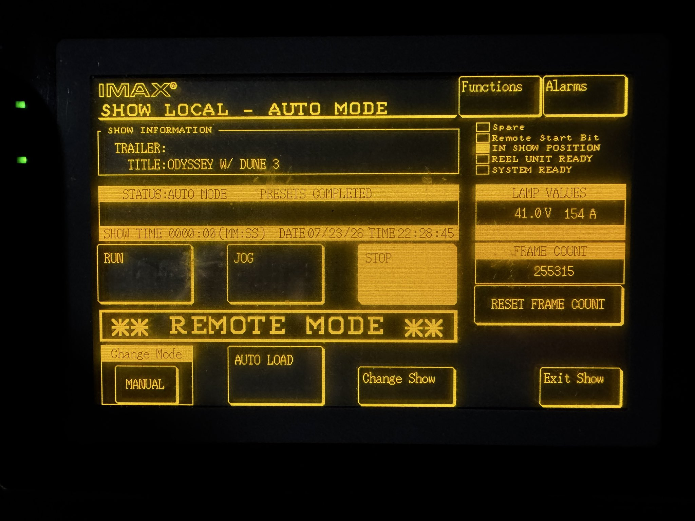
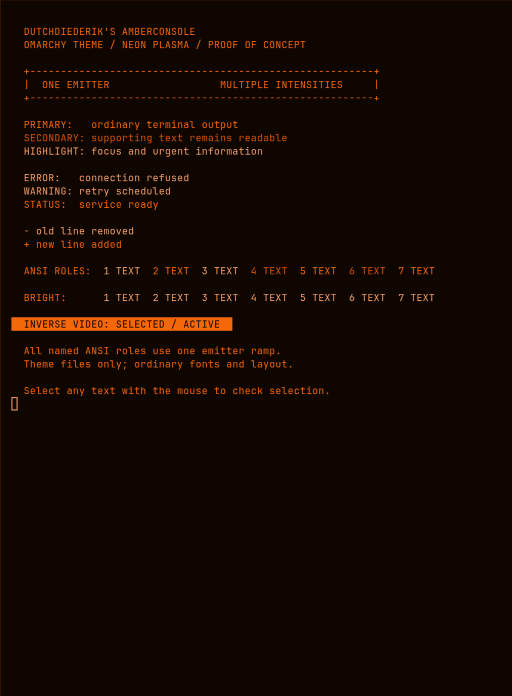

# Dutch Diederik Amber Console

**An affectionate little tribute to [DutchDiederik](https://github.com/DutchDiederik) and his wonderful [AmberConsole](https://github.com/DutchDiederik/AmberConsole).**

Diederik gave us something worth bringing to the desktop: the warm glow and purposeful restraint of old display hardware. One emitter, a handful of intensities, and every line earning its place. Thank you, Diederik, for making those limitations so inviting.

This community adaptation brings AmberConsole's default **neon plasma** palette to [Omarchy](https://omarchy.org) through its normal theme layer. It is an independent tribute, with the original design and palette credited to Diederik.



*The wallpaper is [Jesse Palmer's photograph of an IMAX console](https://x.com/RealJessePalmer/status/2080690462269259848), included unchanged.*

## Install

Tested on **Omarchy 4.0.2**.

```bash
omarchy theme install https://github.com/zigmoo/omarchy-dutch-diederik-amber-console-theme
```

Select it later through **Style → Theme**, or:

```bash
omarchy theme set dutch-diederik-amber-console
```

Use **Style → Background** to switch between the IMAX photograph and the plain warm-black panel.

The theme appears as **Dutch Diederik Amber Console** in Omarchy's picker.

## One emitter, several intensities

AmberConsole takes its cues from hardware that could vary the brightness of a single emitter, rather than assign different hues to different meanings. This theme maps every named ANSI color to that same ramp. Errors, warnings and success states share it; text labels, symbols, intensity and inverse video carry the distinction.

| Role | Color |
| --- | --- |
| Panel | `#100600` |
| Highlight | `#ffa86d` |
| Primary text | `#ff6b08` |
| Secondary text | `#dd5800` |
| Dim border | `#ab4500` |
| Inverse text | `#1e0c00` |

The colors come from [AmberConsole's neon tokens](https://github.com/DutchDiederik/AmberConsole/blob/e616e1c04aaf65d67e485559745421c8226ec4b3/src/tokens/colors.css). This is the neon profile; AmberConsole's separate P3 amber CRT profile has a different ramp.

<details>
<summary>Terminal palette preview</summary>



</details>

## What the theme changes

- `colors.toml` supplies the palette for Omarchy's generated application themes.
- `shell.toml` colors the bar, menus, launcher, notifications and related shell surfaces.
- `backgrounds/` contains the IMAX photograph and a plain panel alternative.

Fonts, layout, widgets and desktop behavior are inherited. The package contains no hooks, scripts, plugins or global configuration changes.

This is a small working palette and surface adaptation. Websites, images and independently styled truecolor output can still contain other colors; the theme does not simulate every hardware effect or typographic rule in the original design system.

## With thanks

- **[DutchDiederik / Diederik](https://diederik.blog)** — AmberConsole's original design, hardware research and palette. Please visit [AmberConsole](https://github.com/DutchDiederik/AmberConsole); it is the heart of this theme.
- **[Jesse Palmer](https://x.com/RealJessePalmer/status/2080690462269259848)** — the IMAX console photograph.
- **[Bjarne Øverli](https://github.com/bjarneo/omarchy-evergreen-theme)** and the Omarchy theme community — the straightforward repository and installation conventions.
- **[Jason Ziegler](https://github.com/zigmoo)** — this Omarchy adaptation.

The upstream **BSD-3-Clause** notice is retained in [LICENSE](LICENSE) for the theme. The IMAX photograph and its identical `preview.jpg` copy retain their original rights and are not covered by that license.
